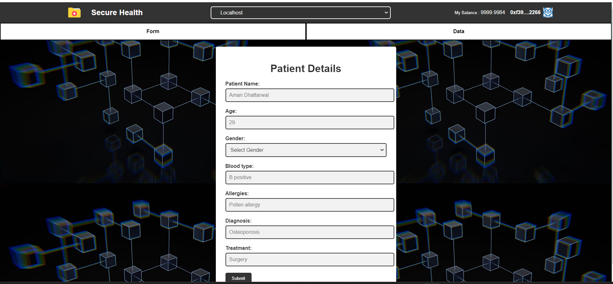

# Blockchain-Based Medical Record Storer

## Overview

This project is a decentralized application (dApp) designed to securely store and manage medical records using blockchain technology. The application leverages the power of Ethereum smart contracts to ensure data integrity and security, and utilizes modern web technologies for an intuitive user interface.

## Technologies Used

- **React.js**: A JavaScript library for building user interfaces, used to create the front-end of the application.
- **Solidity**: A programming language for writing smart contracts on the Ethereum blockchain, used to implement the medical record contracts.
- **Hardhat**: A development environment to compile, deploy, test, and debug Ethereum software, used for deploying the smart contracts.
- **Redux Toolkit**: A library for managing and centralizing application state, used to handle state management in the React application.
- **MetaMask**: A cryptocurrency wallet and gateway to blockchain apps, used to interact with the Ethereum network.

## Features

- **Secure Medical Record Storage**: Medical records are stored on the Ethereum blockchain, ensuring they are immutable and tamper-proof.
- **User Authentication**: Users can authenticate and interact with the dApp using MetaMask.
- **Decentralized Access**: Records can be accessed and managed in a decentralized manner, without relying on a central authority.
- **Intuitive UI**: A responsive and user-friendly interface built with React.js.
- **State Management**: Efficient state management using Redux Toolkit to handle user sessions and application state.

## Getting Started

### Prerequisites

- Node.js and npm installed on your machine
- MetaMask browser extension
- An Ethereum wallet (MetaMask account)
- Hardhat installation

### Installation

1. **Clone the repository**:
   ```bash
   git clone https://github.com/yourusername/blockchain-medical-record-storer.git
   cd blockchain-medical-record-storer
   ```

2. **Install dependencies**:
   ```bash
   npm install
   ```

3. **Compile the smart contracts**:
   ```bash
   npx hardhat compile
   ```

4. **Deploy the smart contracts**:
   ```bash
   npx hardhat run scripts/deploy.js --network {network}
   ```

   Replace `{network}` with the desired network (e.g., `localhost`, `rinkeby`).

5. **Start the React application**:
   ```bash
   npm start
   ```

   The application will be available at `http://localhost:3000`.

### Usage

1. **Connect MetaMask**: Open the application and connect your MetaMask wallet.
2. **Interact with the dApp**: Use the provided interface to add, view, and manage medical records on the blockchain.

   
   

## Project Structure

- **contracts/**: Contains Solidity smart contracts.
- **scripts/**: Deployment scripts for the smart contracts.
- **src/**: Contains the React application source code.
  - **components/**: Reusable React components.
  - **redux/**: Redux Toolkit slices and store configuration.
  - **views/**: Application views and pages.
- **hardhat.config.js**: Hardhat configuration file.
- 

## Contributing

Contributions are welcome! Please follow these steps:

1. Fork the repository.
2. Create a new branch (`git checkout -b feature-branch`).
3. Make your changes and commit them (`git commit -m 'Add some feature'`).
4. Push to the branch (`git push origin feature-branch`).
5. Open a Pull Request.

## Acknowledgments

- Ethereum and Solidity documentation for providing comprehensive resources.
- MetaMask for enabling seamless interaction with the Ethereum blockchain.
- Redux Toolkit for simplifying state management in React.

## Contact

For any inquiries or feedback, please contact sumitrajtiwari2022@vitbhopal.ac.in .
